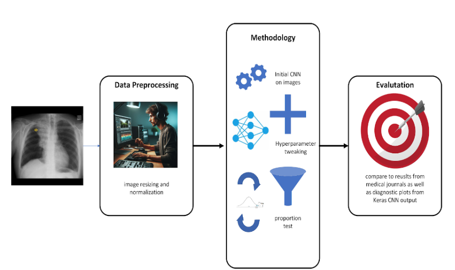

[![Contributors][contributors-shield]][contributors-url]
[![Issues][issues-shield]][issues-url]
[![MIT License][license-shield]][license-url]

<br />
<div stye="text-align: center;">

  <a href="https://docs.google.com/document/d/1WOiV5psf3YJbPYVcKOZC4vbGYx6a2B_kzh-NY8xZ-_4/edit?usp=sharing">
    </img>
  </a>
</div>
<br />

# Melanoma Cell Classification

<details>
  <summary><strong>Table of Contents</strong></summary>
  <ol>
    <li><a href="#authors">Authors</a></li>
    <li><a href="#repository-contents">Repository Contents</a></li>
    <li><a href="#software-and-platform">Software and Platform</a></li>
    <li><a href="#file-tree">File Tree</a></li>
    <li><a href="#reproducing-results">Reproducing Results</a></li>
  </ol>
</details>
<br />

## Authors: 
Maajid Husain - mah2ksc@virginia.edu <br />
Colby Le - ncc9kn@virginia.edu <br />
Mohammad Murad - vdr4jr@virginia.edu

## Repository Contents

This repository contains scripts for the purpose of creating a Convolutional Neural Network (CNN) that can identify whether a given image of melanoma (skin cancer cells) are benign or malignant. The research question of interest concerns whether CNNs can accurately classify histopathological images, judging by current scientific literature about the proportions of malignant-to-benign cells. This project will help explore the viability of utilizing CNNs in the healthcare industry, specifically in allowing healthcare providers to detect the cancer early on and treat it if needed. The image data from this project is sourced from [ISIC (The International Skin Imaging Collaboration)](https://www.isic-archive.com/).

In the SCRIPTS directory, [SCRIPTS/EDA.ipynb](SCRIPTS/EDA.ipynb) performs exploratory data analysis on the data, including viewing a small sample of the data and seeing how many of the images we have are benign or malignant. [SCRIPTS/CNN.ipynb](SCRIPTS/CNN.ipynb) utilizes the CNN model, first proving some variability in the image data itself, then building the CNN model with the training data and then classifying the test data. The accuracy of the model is revealed here. 

## Software and Platform
We are writing our scripts in Jupyter notebooks for readability. Notable packages we used were `keras` package to build the CNN model itself, including `keras.models` and `keras.layers`. We also used the `keras.preprocessing.image` package to provide the variability in the image dataset. We chose VSCode Mac/Windows as our preferred IDE and Git for version control.

## File Tree
```
.
├── DATA
│   ├── ISIC-images
        ├── ALL IMAGES
│   ├── metadata.csv
├── LICENSE
├── OUTPUT
│   ├── data_overview.png
├── README.md
└── SCRIPTS
    ├── analysis_plan.png
    ├── CNN.ipynb
    ├── EDA.ipynb
```

## Reproducing Results
1. Navigate to [ISIC](https://www.isic-archive.com/) and download the 'Challenge 2018: Task 1-2: Test' dataset zip file.
2. Unzip the dataset and move it to the DATA/... folder.
3. Run the SCRIPTS/EDA.ipynb notebook to glean insights from the data.
4. Run the SCRIPTS/CNN.ipynb notebook to utilize the CNN model, first proving some variability in the image data itself, then building the CNN model with the training data and then classifying the test data

[contributors-shield]: https://img.shields.io/github/contributors/colbyle25/skin-cancer-deep-learning.svg?style=for-the-badge
[contributors-url]: https://github.com/colbyle25/skin-cancer-deep-learning/graphs/contributors
[stars-shield]: https://img.shields.io/github/stars/colbyle25/skin-cancer-deep-learning.svg?style=for-the-badge
[issues-shield]: https://img.shields.io/github/issues/colbyle25/skin-cancer-deep-learning.svg?style=for-the-badge
[issues-url]: https://github.com/colbyle25/skin-cancer-deep-learning/issues
[license-shield]: https://img.shields.io/github/license/colbyle25/skin-cancer-deep-learning.svg?style=for-the-badge
[license-url]: https://github.com/colbyle25/skin-cancer-deep-learning/blob/master/LICENSE
[product-screenshot]: public/Images/_Common
